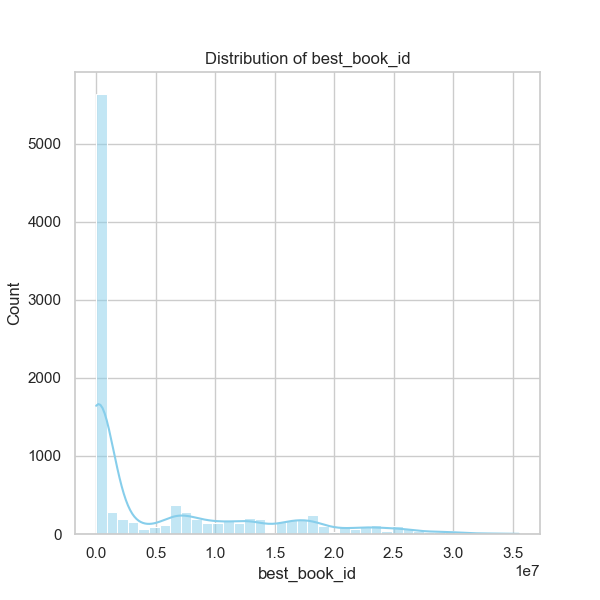

### Overview of Data Analysis Results from 'goodreads.csv'

The dataset consists of 10,000 entries with detailed information about books, including identifiers, authors, publication years, ratings, and review counts. This analysis explores trends, anomalies, and correlation patterns present in the data, offering insights that can inform future strategic decisions in areas such as marketing, editorial selection, and user engagement strategies.

### Key Insights and Observations

1. **Author Popularity**: 
   - The dataset contains 4,664 unique authors, with "Stephen King" being the most frequently represented, appearing 60 times. This signals that certain authors significantly capture reader interest and loyalty, which can be leveraged in targeted marketing campaigns, partnerships, or book recommendations.

2. **Average Ratings**: 
   - The average book rating is approximately 4.00 (mean = 4.002). A standard deviation of 0.254 indicates that ratings are generally clustered around the average, which suggests that most books are well-received. This insight can guide publishers in determining potential bestsellers and in curating reading lists for readers.

3. **Publication Year Trends**:
   - The average original publication year is around 1982, with a sizeable standard deviation (±152.58 years), implying a diverse range of books, from classics to contemporary works. This can inform marketing strategies to appeal to different reader demographics, ranging from those who favor modern literature to those who enjoy classic works.

4. **Ratings and Reviews**:
   - The distribution of ratings reveals a strong correlation between the ratings given (scores of 1 to 5) and the total ratings count across the dataset. This indicates that books with higher average ratings also tend to garner more total ratings. With a correlation above 0.9 for ratings counts with scores from 1 to 5, highlighting the self-reinforcing nature of quality metrics, publishers may prioritize working with high-rated authors and promoting well-received titles.

5. **Anomalies in ISBN and Title Count**:
   - There are missing values in ISBN and ISBN-13 fields (700 and 585 missing respectively), which presents a challenge for data completeness. Additionally, there appears to be a non-standard title entry with a frequency simply noted as a space (' '). This suggests data entry inconsistencies that could bias analyses. Ensuring data integrity by addressing these anomalies is crucial for accurate assessments.

### Correlation Insights

- **Books Count and Ratings**: 
   - A negative correlation exists between the number of books an author has published and their ratings count (correlation ≈ -0.26). This implies that authors with extensive bibliographies may not always receive high ratings on average, suggesting that more focused marketing might benefit new or less prolific authors.

- **Work Ratings Count and Text Reviews**: 
   - There is a strong positive correlation (≈ 0.807) between work ratings count and work text reviews, indicating that books with more ratings often accrue more textual reviews. This suggests that encouraging readers to leave detailed feedback might enhance community engagement and provide more insights into reader sentiments.

### Further Analysis Recommendations

1. **Clustering Analysis**:
   - Conduct a clustering analysis on average ratings, ratings count, and the number of text reviews to segment books into categories such as "bestsellers," "hidden gems," and "poor performers." This can guide marketing efforts and acquisitions by identifying trends within these segments.

2. **Anomaly Detection**:
   - Implement anomaly detection techniques to identify outlier books based on unusual rating patterns or review counts. For example, books with disproportionately high ratings compared to their reviews may provide opportunities for further investigation or targeted promotional strategies.

3. **Time Series Analysis**:
   - A time series analysis of average ratings and reviews over the years could reveal trends and cyclical patterns that may inform future publication schedules and marketing strategies.

4. **Sentiment Analysis**:
   - Performing a sentiment analysis on textual reviews could provide deeper insights into reader preferences and critique, helping authors and publishers fine-tune their offerings based on reader sentiment.

### Strategic Implications

Understanding these trends can significantly impact marketing strategies, author promotions, and content development directions. By focusing on high-rated books and leveraging popular authors, institutions can optimize resource allocation for promotions. Addressing data integrity and performing further targeted analysis will ensure that insights drawn from this data lead to informed decision-making and resonate well with evolving reader demographics and preferences.

