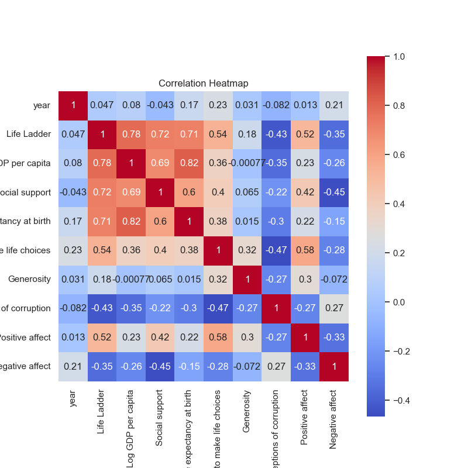

### Narrative Based on Data Analysis Results from 'happiness.csv'

#### Overview
The dataset `happiness.csv` encapsulates various metrics about happiness, quality of life, and societal well-being across different countries over a span of years from 2005 to 2023. The variables include happiness scores, economic indicators, social factors, and perceptions of governance. With a total of 2,363 observations and multiple metrics, this analysis serves to unveil intrinsic insights regarding global happiness trends.

### Summary of Key Findings

1. **Central Trends**:
   - The average **Life Ladder** score—a metric commonly associated with the perceived quality of life—stands at approximately 5.48, indicating a generally moderate level of happiness across these countries. The scores vary significantly, with a minimum of 1.281 and a maximum of 8.019, suggesting variance in happiness levels among countries.
   - The **Log GDP per capita** averages around 9.40, which is indicative of varying economic conditions. Countries may experience higher life satisfaction with higher GDPs, aligning with typical economic theories.

2. **Societal and Health Factors**:
   - A robust average **Social Support** score of 0.81 reveals a considerable perception of social networks contributing to happiness. 
   - **Healthy life expectancy** is relatively high, averaging about 63.4 years, implying that most countries provide decent health services, although there are notable discrepancies—a minimum of 6.72 years suggests some regions struggle significantly with health outcomes.

3. **Freedom and Security**:
   - The **Freedom to make life choices** registers a mean score of 0.75, reflecting a general sentiment of autonomy among individuals in these nations. 
   - A concerning average of 0.74 for **Perceptions of Corruption** indicates a prevalent belief that corruption is a significant issue in many of these societies, negatively impacting citizens' trust and happiness.

4. **Emotional Well-Being**:
   - Positive affect, averaging around 0.65, mirrors a somewhat optimistic outlook among individuals, while the **Negative affect** average of 0.27 suggests underlying issues that contribute to unhappiness, possibly correlated with other societal factors such as corruption.

### Insights from Correlation Analysis

- A strong positive correlation (0.78) between **Life Ladder** and **Log GDP per capita** suggests that increases in economic wealth could directly enhance perceived happiness. This correlation has substantial implications for economic policy.
- The significant correlation (0.72) between **Life Ladder** and **Social support** emphasizes the importance of social frameworks in yielding happier societies.
- Conversely, the **Perceptions of corruption** feature a notable negative correlation (-0.43) with Life Ladder scores, underscoring how governance and ethical frameworks significantly impact subjective well-being.

### Anomalies and Outliers

- Countries showing exceptionally high or low Life Ladder scores relative to GDP should be identified as candidates for further analysis. For example, a nation with a high GDP but a low Life Ladder may indicate that wealth may not translate to well-being due to other negative societal factors (like corruption).
- Cases with significantly reduced Healthy life expectancy should also be further examined, especially those countries reflecting both low life expectancy and high negative affect.

### Recommendations for Further Analysis

1. **Clustering Analysis**:
   - Implement a clustering algorithm (e.g., K-means or hierarchical clustering) based on Life Ladder scores, GDP per capita, and social support to identify groupings of countries with similar happiness profiles. This could help target specific regions for development interventions.
   
2. **Anomaly Detection**:
   - Utilize techniques like Isolation Forest or DBSCAN to detect anomalies or unusual patterns in Life Ladder scores against economic indicators and political factors, focusing on countries that do not conform to typical patterns.

3. **Longitudinal Study**:
   - A year-by-year analysis of trends over time could provide insights into how happiness levels change in response to global events, policies, or economic shifts. This would be especially relevant given the data covers nearly two decades.

4. **Causal Analysis**:
   - Consider utilizing methods like Granger causality tests to examine whether certain variables (e.g., GDP, corruption perception) genuinely influence changes in happiness levels over time.

### Conclusion and Future Implications

The findings point to overarching trends that suggest an intricate relationship between economic performance, social support, governance, and happiness. Future policies should focus on improving social welfare and governance, particularly in nations struggling with high corruption levels and economic disparities. As the data evolves, continuous monitoring and responsive strategies will be paramount for enhancing global well-being. 

The insights gleaned from this analysis can aid governments, NGOs, and policymakers in creating environments conducive to improved happiness, potentially resulting in greater societal stability and productivity.

