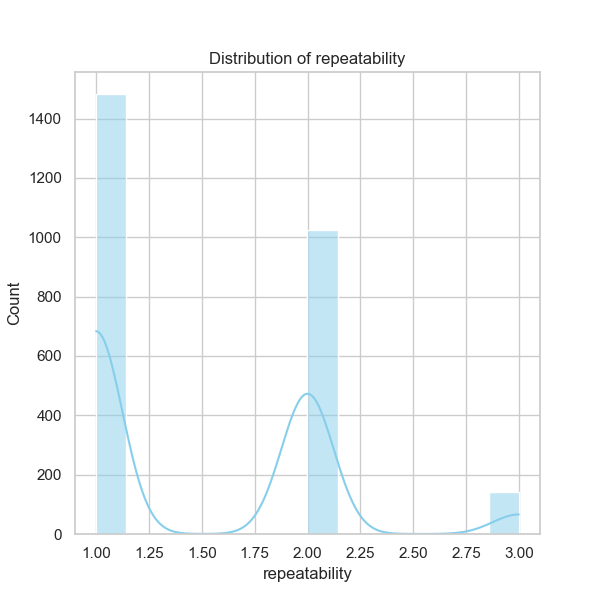

Based on the analysis of the dataset `media.csv`, containing a total of 2,652 entries across various media types, several insights can be gathered. Here’s a detailed narrative based on the provided summary statistics, missing values, and correlation data.

### Overview

1. **Dataset Composition**
   - The dataset contains information spanning various attributes: `date`, `language`, `type`, `title`, `by`, `overall`, `quality`, and `repeatability`.
   - Notably, the dataset features 2,553 unique dates, predominantly in English (1,306 entries), with movies being the dominant type (2,211 entries).

2. **Key Statistics**
   - The average `overall` rating is approximately 3.05, with a standard deviation of 0.76, indicating moderate ratings spread around a generally favorable view.
   - `Quality` ratings average at 3.21 with a similar standard deviation, also confirming a generally favorable perception.
   - However, `repeatability` has a notably lower mean of 1.49, suggesting that most media titles are not highly repeatable, as reflected by its lower scores, where 1 and 2 form the majority.

### Missing Data
- There are 99 missing values in the `date` column, which could hinder time-series analysis or longitudinal assessments.
- The `by` column has 262 missing values, which could affect analyses regarding prominent figures in the dataset.

### Correlation Insights
- **Strong Correlation**: The correlation between `overall` and `quality` is quite strong (0.83), suggesting that higher quality ratings lead to higher overall ratings.
- **Moderate Correlation**: The correlation of `overall` with `repeatability` (0.51) indicates a medium relationship; higher overall ratings may correlate with higher repeatability but with less certainty.
- **Further Insights**: The correlation between `quality` and `repeatability` is weaker (0.31). This may suggest that the perceived quality of a title does not necessarily relate to how often it is revisited by audiences.

### Trends and Patterns

- **Frequent Titles**: The title "Kanda Naal Mudhal" was noted the most frequently (9 times), indicating a recurrent theme, possibly pointing toward notable cultural or critical reception.
- **Dominant Language and Type**: With English being the leading language and movies dominating the type category, it forms a notable trend that may affect marketing and distribution decisions.
  
### Outliers and Anomalies
- The dataset's mean ratings imply a general trend towards moderate approval, but outlier analysis (defining higher and lower ratings) may reveal extremes that could be of interest for marketing or other strategies.
  
### Recommendations for Further Analysis

1. **Clustering Analysis**: Implement clustering algorithms (like K-means or hierarchical clustering) to segment the media items based on `overall`, `quality`, and `repeatability` ratings. This could help identify specific sub-groups, aiding targeted marketing strategies or programming decisions.
  
2. **Anomaly Detection**: Employ anomaly detection mechanisms to identify media items or creators whose ratings markedly deviate from the norm, indicating potential quality issues or high-impact titles that require strategic focus.

3. **Temporal Trends**: Investigate temporal trends by filling missing dates or imputing using mean/mode, then performing time-series analysis to discover changes in ratings over time. This could highlight seasonal content appeal or the impact of specific events (like festivals).

4. **Multivariate Analysis**: Perform regression analyses to predict `overall` ratings based on `quality`, `repeatability`, and possibly `by`. This can illuminate how to create higher-rated media through targeted improvements.

### Implications for Future Decisions

- **Content Development**: Understanding the predominant genres, titles, and creators could guide content creation decisions to align with audience preferences.
- **Quality Improvements**: Focusing on improving repeatability through better-quality content could enhance overall audience retention.
- **Targeted Marketing**: Insights into language distribution and viewing trends could tailor marketing and distribution strategies to specific demographics or regions more effectively.

In conclusion, the narrative derived from the dataset points to various opportunities and challenges for content creators and distributors. By leveraging insights gained from the data, organizations can make data-driven decisions aimed at improving the overall reception and sustainability of their media offerings.

